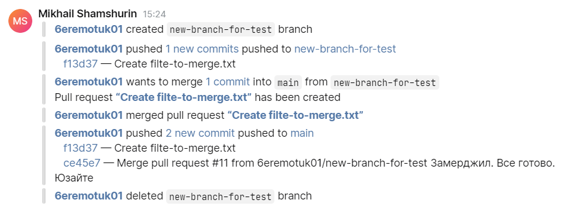

# GitHub-spam-bot

Простой JetBrains Space бот, который уведомляет членов чата о произошедших событиях в репозитории.

<p align="center">
	    
</p>


## Оповещения

Бот умеет оповещать о:

- **Push**
	- внесение изменений
	- удаление ветки
	- добавление ветки

- **Pull Requests**
	- создание запроса на вливание
	- закрытия запроса на вливание
	- уведомление о совершенном вливании


## Начало работы

Для использования бота необходимо создать вебхук со следующими событиями:

- **Pull request review comments**
- **Pull requests**
- **Pushes**
- **Pull request reviews**

Для того, чтобы запустить бота необходимо указать обязательные параметры внутри main.py:

- **JETBRAINS_ORGANIZATION_DOMAIN_NAME** — наименование вашей рабочей группы в Space
- **JETBRAINS_CLIENT_ID**  — идентификатор приложения (сервисный аккаунт, приложение и т.п., которое будет отправлять собщение)
- **JETBRAINS_CLIENT_SECRET** — секретный ключ приложения
- [Маршруты для сообщений](#настройка-маршрутизации-оповещений)


## Настройка маршрутизации оповещений

В боте присутствуют настройки маршрутизации и гнорирования сообщений по определенным веткам.

### Типы маршрутизации

Внутри файла `main.py` машруты указываются по 2 путям:

- **PUSH_ROUTE_NAMES**  — фильтрация по push событию
- **PULL_ROUTE_NAMES**  — фильтрация по pull событию

### Перенаправление определенной ветки

```python
PUSH_ROUTE_NAMES = {
    # DEFAULT — обязательный параметр,
    # который указывает, куда отправлять
    # данные из других branch`ей
    'DEFAULT': "it_github_bot",
    'name-of-branch': 'channel-name' # События в ветке "name-of-branch" будут отправлены в чат 'channel-name'
}
```

### Игнорирование определенной ветки
```python
PUSH_ROUTE_NAMES = {
    # DEFAULT — обязательный параметр,
    # который указывает, куда отправлять
    # данные из других branch`ей
    'DEFAULT': "it_github_bot",
    'name-of-branch': None # События в ветке "name-of-branch" будут проигнорированы,
                           # а все остальное будет направлено в "it_github_bot"
}
```

### Отправлять только определенные ветки
```python
PUSH_ROUTE_NAMES = {
    # DEFAULT — обязательный параметр,
    # который указывает, куда отправлять
    # данные из других branch`ей
    'DEFAULT': None,
    'name-of-branch': 'channel-name' # События в ветке "name-of-branch" будут отправлены в чат 'channel-name'
                                     # а все остальное будет проигнорированно
}
```


## Yandex Cloud

Вы можете ознакомиться с версией для [Yandex Cloud Functions](https://cloud.yandex.ru/) — `main—yc.py`
